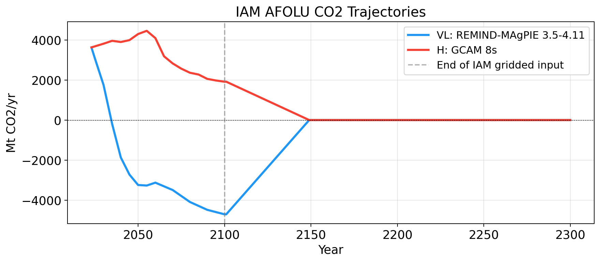
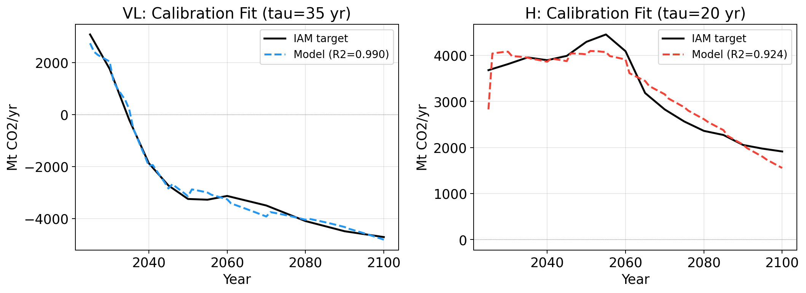
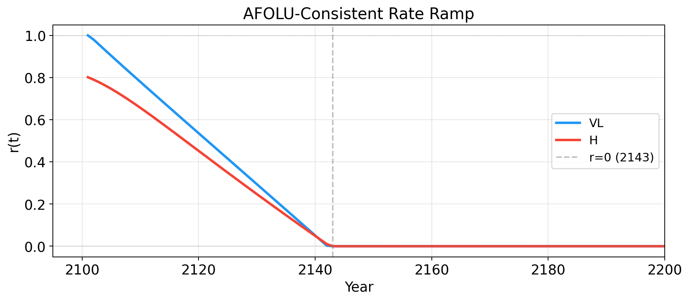
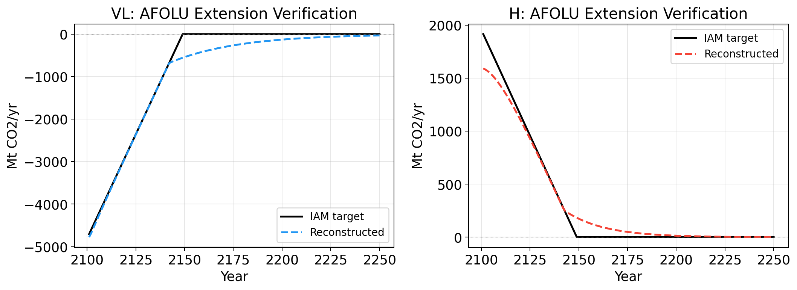
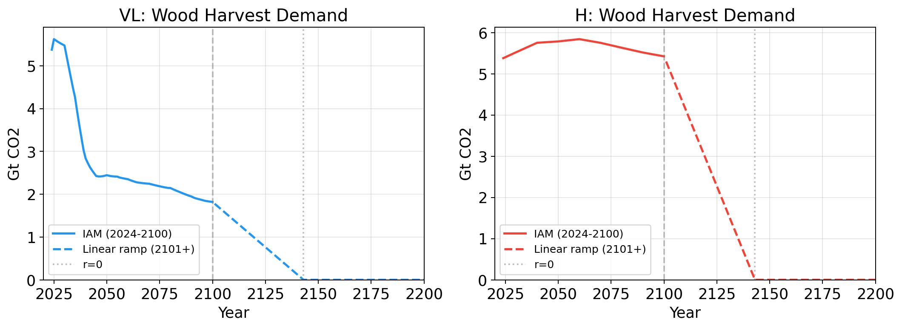

# Extending LUH3 Land‑Use Fields Beyond 2100

**Progress update — March 2026**

Ben Sanderson

---

## The problem

IAMs give us gridded land-use states + rates to **2100**, but CMIP needs fields to **2500**.

We also have a global **AFOLU CO₂ trajectory** out to 2500:

A naive linear ramp of rates to zero ignores carbon-cycle inertia — regrowing forests keep absorbing CO₂ long after planting. We need a smarter ramp.

---

## The carbon-cycle model

Four-predictor regression fit to pre-2100 IAM data:

$$\text{AFOLU}(t) = \beta + \gamma \cdot t + \alpha_{\text{trans}} \cdot F^{\text{trans}}(t) + \alpha_{\text{stock}} \cdot F^{\text{stock}}(t;\, \tau)$$

| Term | What it captures |
|------|-----------------|
| $\beta + \gamma \cdot t$ | Baseline + secular trend |
| $\alpha_{\text{trans}} \cdot F^{\text{trans}}$ | Instantaneous carbon from land-type conversion |
| $\alpha_{\text{stock}} \cdot F^{\text{stock}}$ | Cohort-based regrowth: $G_v(t) = G_v(t{-}1)\,e^{-1/\tau} + \Delta A_v(t)$ |

Stock-change creates **committed removals** from past reforestation that decay with timescale $\tau$. Profile-likelihood scan over $\tau$; OLS for the rest.

---

## Calibration fit

Four-predictor regression fit to pre-2100 IAM data:

$$\text{AFOLU}(t) = \beta + \gamma \cdot t + \alpha_{\text{trans}} \cdot F^{\text{trans}}(t) + \alpha_{\text{stock}} \cdot F^{\text{stock}}(t;\, \tau)$$

---

## Calibration results

| | **VL** (Very Low) | **H** (High) |
|---|---|---|
| Model / IAM | REMIND-MAgPIE | GCAM 8s |
| State vars | 13 (full LUH set) | 9 (aggregated) |
| $\tau$ | 35 yr | 20 yr (fixed) |
| $R^2$ | 0.990 | 0.924 |
| Ramp → 0 at | 2143 | 2143 |
| Committed removal | −660 Mt CO₂/yr | +247 Mt CO₂/yr |

VL: strong fit, large committed sink from ongoing reforestation.
H: noisier (fewer categories), 3-predictor fallback ($\alpha_\text{stock}$ forced to 0).

---

## Forward solve → the AFOLU-consistent ramp

Invert the model to get $r(t)$:

$$r(t) = \frac{\text{AFOLU}_{\text{target}}(t) - \alpha_{\text{stock}} \cdot S_{\text{committed}}(t)}{\text{baseline} + \alpha_{\text{trans}} \cdot F^{\text{trans}}_{\text{unit}} + \alpha_{\text{stock}} \cdot S_{\text{new}}}$$

Each year feeds back into next year's cohort → sequential solve, clamped to $[0, 1]$.

Both reach zero by ~2143, but the *shapes* differ due to stock-change feedback.

---

## Verification: reconstructed vs target AFOLU

Does the ramp reproduce the IAM trajectory when plugged back in?

Gridded extension applies $r(t)$ cell-by-cell: $\;f_v(t{+}1) = f_v(t) + r(t) \cdot \dot{f}_v^{2100}$

Per-cell conservation enforced (fractions sum to 1, clamped ≥ 0, residual absorbs excess). Output: 0.25° NetCDF, ~1.4 GB total for both scenarios.

---

## Wood harvest + next steps

Wood harvest demand ramped linearly (country-level); for GLM3: $h(t) = \max(h_{\text{maint}},\, \text{file})$

**Done** ✓ VL + H complete, shared on Google Drive, pipeline automated (`src/pipeline.py`)
**Next** → 5 remaining scenarios (L, LN, M, ML, HL) as input data arrives
